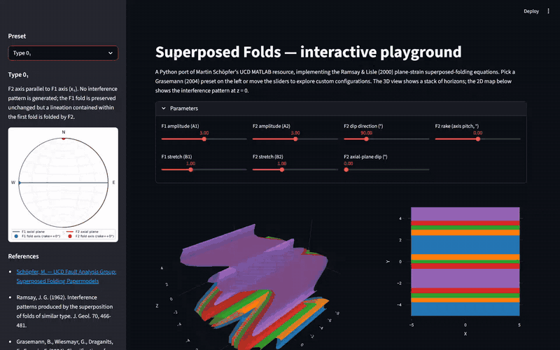

# superposed-folds

Interactive Python toolkit for visualizing superposed folds. A modern Python
port of Martin Schöpfer's MATLAB papermodel resource at the
[UCD Fault Analysis Group](https://www.fault-analysis-group.ucd.ie/SuperPosedFolds/Superposed_PM_Index.html),
implementing the plane-strain superposed-folding equations from Ramsay & Lisle
(2000) and the extended Grasemann et al. (2004) classification.

[](https://superposed-folds.streamlit.app/)



Pick a Grasemann (2004) preset on the left or move the sliders. The 3D fold
stack, the 2D interference map at z = 0, the stereonet, and the classification
readout all update together. Optionally enable a cylindrical drill core to see
the same interference pattern intersecting a borehole at any collar position,
azimuth, and plunge, rendered both embedded in the 3D layer stack and unrolled
flat as a depth-vs-circumference strip.


## What's inside

- A small Python library (`superposed_folds`) implementing:
  - `FoldParameters` and the Ramsay & Lisle plane-strain equations
  - Forward (`apply_superposed_fold`) and inverse (`initial_z_at`) maps
  - All 21 canonical Grasemann (2004) preset configurations
  - `DrillCoreParameters` and `sample_layers_on_cylinder` for sampling the
    folded model on the curved surface of a cylindrical borehole at any
    orientation
  - Plotly figure builders: 3D fold stack with optional drill-core trace,
    2D interference map at z = 0 with optional collar/line/toe overlay,
    stereonet, and an unrolled drill-core section
- A Streamlit app (`streamlit_app.py`) for the interactive playground.
- pytest suite with parity checks against the original UCD MATLAB code.

## Install

```bash
git clone <repo>
cd superposed-folds
uv venv
uv pip install -e ".[app,dev]"
```

## Run the web app locally

```bash
uv run streamlit run streamlit_app.py
```

## Run the tests

```bash
uv run pytest
```

## Credits and references

- **Original MATLAB resource and educational content**: Martin Schöpfer, UCD Fault Analysis Group ([page](https://www.fault-analysis-group.ucd.ie/SuperPosedFolds/Superposed_PM_Index.html))
- **Plane-strain equations**: Ramsay, J. G. and Lisle, R. J. (2000) *The Techniques of Modern Structural Geology, Volume 3*. Academic Press, p. 955.
- **Classification (original)**: Ramsay, J. G. (1962) *J. Geol.* 70, 466-481.
- **Classification (extended)**: Grasemann, B. et al. (2004) *J. Geol.* 112, 119-125.
- Project surfaced via the [Software Underground](https://softwareunderground.org) Mattermost.

## License

MIT. See `LICENSE`.
